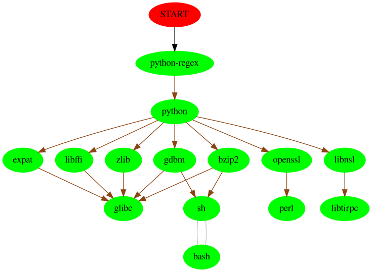
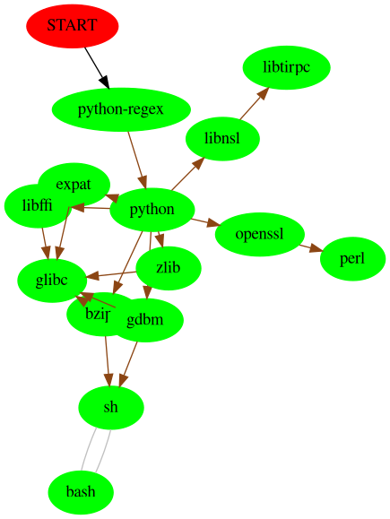
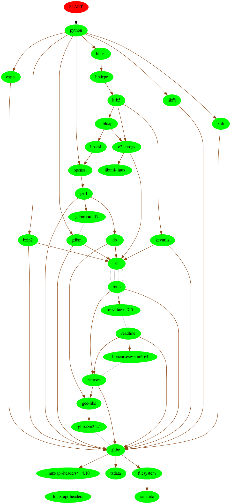

# This is the documentation for graph visualization 

## 1. Pactree

Install pactree 

```shell
pacman -S pacman-contrib
```

Following command helps to export the graph from command line:

**usage**

```shell
pacman <PACKAGE_NAME> -d<DEPTH_OF_TREE> --graph | <ENGINE> -Tpng >[EXPORT_FILENAME]
```

**example**

```shell
pactree python-regex -d3 --graph | dot -Tpng >regex.png
```

***--graph*** generates a Graphviz description.

***-Tpng*** described the format of the output. (Syntax -T<name of the format>)

***available formats for -T:***

cmapx: Produces HTML map files for client-side image maps. 

pdf: Adobe PDF via the Cairo library. 

png: PNG (Portable Network Graphics) output. 

ps: PostScript (EPSF) output. 

ps2 PostScript (EPSF) output with PDF annotations. 

svg: SVG output. 


**There are two engines from grafviz:** 

1. dot (example of ***python-regex***)

   

2.  Neato (example of ***python-regex***)

   


# 2. Pactree + Python


Python is executing the command "**pactree**". Pactree returns digraph.

This diagram is being written as .gv file. On rendering the file it will generate image for given package. No control of the depth.

### Example: Tree of python



